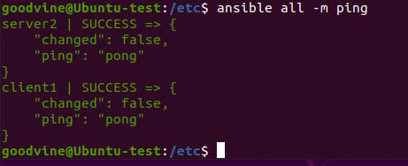
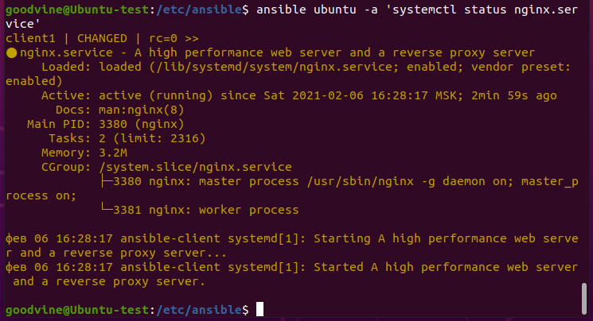

#  Выполнение задания Task3 (Ansible)  #  
  
 Развернуты 2 виртуальные машины с Ubuntu 20.04LTS 
 1. Сервер 192.168.0.1  
 2. Клиент 192.168.0.10  user: ansclient
 3. Для проверки пинга также используется  ранее установленная машина с Debian8: 192.168.0.112  
 
##  Установка  Ansible  ## 

sudo apt install ansible - последняя  

Для установки версии 2.8.10 исползуем pip

>	sudo apt update
>	sudo apt install python3-pip
>	sudo -H pip3 install ansible==2.8.10  
или
>	pip3 install --user ansible==2.8.10

##  Настройка  Ansible  ## 

### 1. Подключение по ssh
	На клиенте разрешаем подключение по ssh . При необходимости установим 
    >   openssh-server  

    Проверим:  
    >	sudo systemctl status ssh  

    Генерируем ssh ключи на сервере управления  Ansible
    >	ssh-keygen  

	Копируем отклытый ключ на клиента:
	>	cat ~/.ssh/id_rsa.pub  
	
	Подключаемся по ssh к клиенту м вставляем 
	>	nano ~/.ssh/authorized_keys  
	
	меняем permissions
	>	chmod 600 authorized_keys  
	
	или проще 
	>	ssh-copy-id ansclient@192.168.0.10
	
### 2. На сервере управления Ansible настраиваем hosts:  
	>	sudo nano /etc/ansible/hosts  
	
	##### Так как в Ubuntu python3, а в Debian - python2 разделим по группам:
	[ubuntu]  
        client1 ansible_host=ansclient@192.168.0.10  
	[ubuntu:vars]  
        ansible_python_interpreter=/usr/bin/python3  
	[debian]  
        server2 ansible_host=root@192.168.0.112  
        #host3 ansible_host=92.168.0.113  
	[debian:vars]  
        ansible_python_interpreter=/usr/bin/python  
		
	Переменные рекомендуют хранить в отдельных файлах {host,group}_vars, но для выполнения задания не буду усложнять структуру  

	Проверяем hosts:
	
	>	ansible-inventory --list -y  
	
	Проверяем подключение: 
	
	>	ansible all -m ping   # здесь не указывается пользователь, т.к. я его указал явно в hosts  
	

	
	Можно вместо ping узнать использование дискового пространства:  
	
	>	ansible all -a "df -h"  
	
### 3. Создаем playbook по установке nginx:  

	>	/etc/ansible/palybooks/first-nginx.yml
		
	используем хост:	client1
	запуск с привилегиями:	become
    метод:	sudo
	задания:	tasks
    имя задания:	name: Installs nginx
    выполнить:	apt: pkg=nginx
	
	##### Запуск playbook  
	
	с запросом пароля:
	>	ansible-playbook first-nginx.yml	--ask-become-pass
	
	Удобнее без итерактивного ввода пароля:
	>	ansible-playbook first-nginx.yml --extra-vars "ansible_sudo_pass=pass_ansclient"
	
	Можно создать зашифрованный файл password
	>	 ansible-vault create password  
	и использовать его в:
	vars_files:
    - password
	
	##### Проверяем результат выполнения playbook 
	>	ansible ubuntu -a 'systemctl status nginx.service'
	
  
	
### 4.  Плейбук по установке LAMP

	* Используемые переменные:
	
	- mysql_root_password: "RootPass" - для изменения дефолтного (пустого) пароля root к базе MySQL
	- http_host: "test.loc"  -  имя хоста (сайта)
	- http_conf: "test.loc.conf" - файл конфигурации хоста
	
	* Устанавливаемые пакеты:
	'apache2', 'mysql-server', 'php', 'php-mysql', 'libapache2-mod-php' 'python3-pymysql' , последний для подключения python к MySQL при изменении пароля

	* создаем папку хоста apache в /var/www/
	можно поменять пользователя и группу на www-data и выставить permissions  755, хотя работает и без смены пользователя
	
	* копируем apache.conf.j2 sites-available
	в нем меняется имя хоста, согласно переменной http_host
	
	* Enable site 
	разрешаем новый конфиг в apache
	
	* Disable default Apache site
	отключаем дефолтный конфиг
	у меня была пару раз проблема с отключением при тестировании плейбука - ругался на отсутствие файла, 
	поэтому добавил проверку на наличие файла 000-default.conf с помощью:
	stat:
        path: /etc/apache2/sites-available/000-default.conf
    register: conf
	
	* Move test.php
	добавляем index.php в папку хоста
	
	* Start Apache, MySQL, PHP
	запускаем установленные службы
	
	* Sets MySQL root password
	меняем дефолтный пасс к MySQL
	
	* handlers
	Если я правильно разобрался, используется для перезапуска apache при изменении конфига, чтобы подхватить изменения
	
	##### Проверяем результат выполнения playbook 
	
  