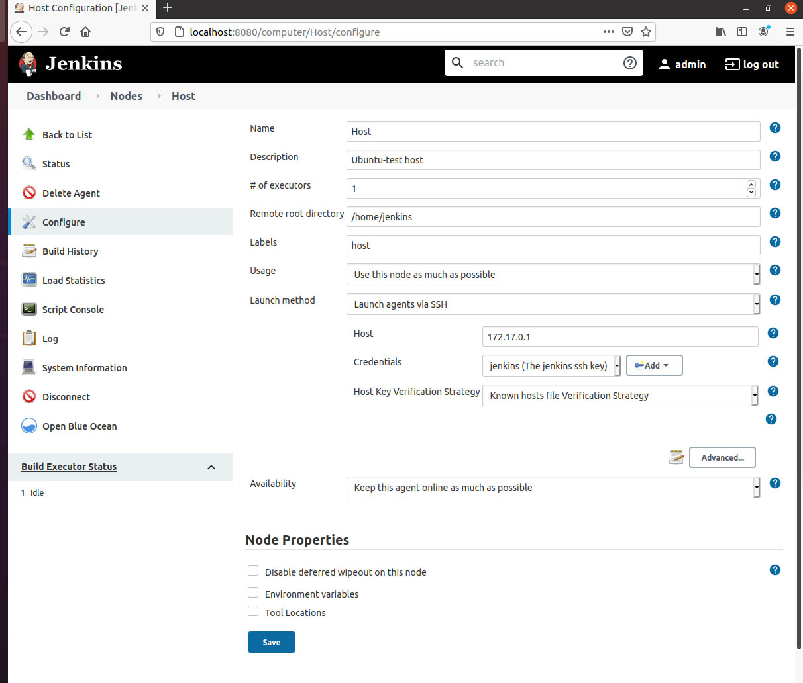
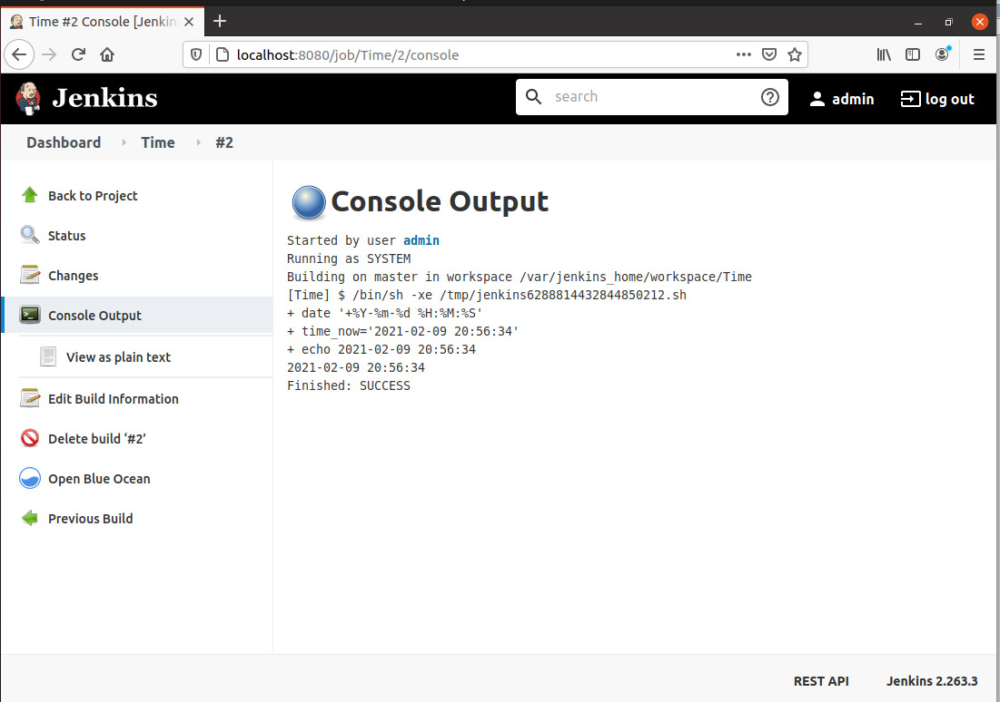
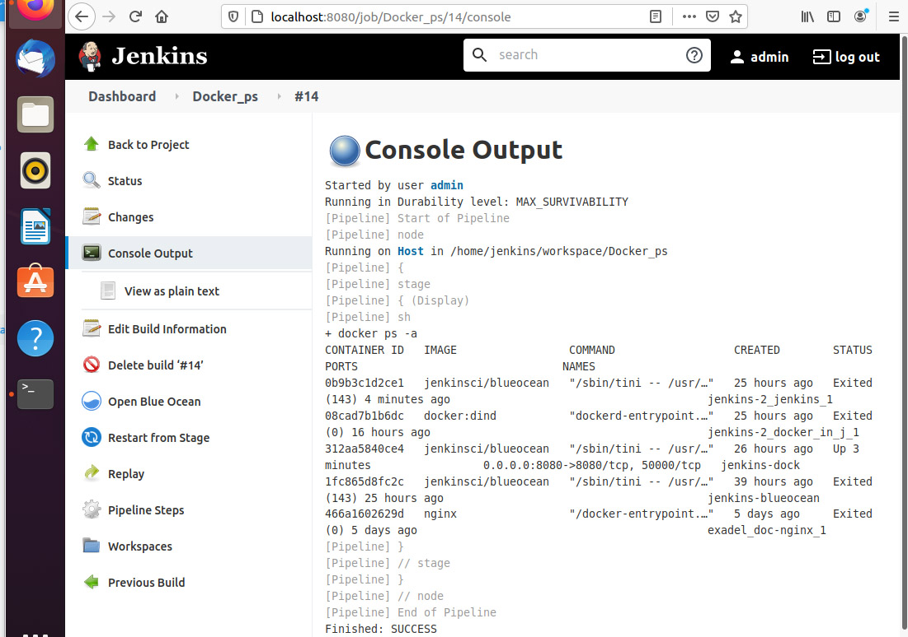
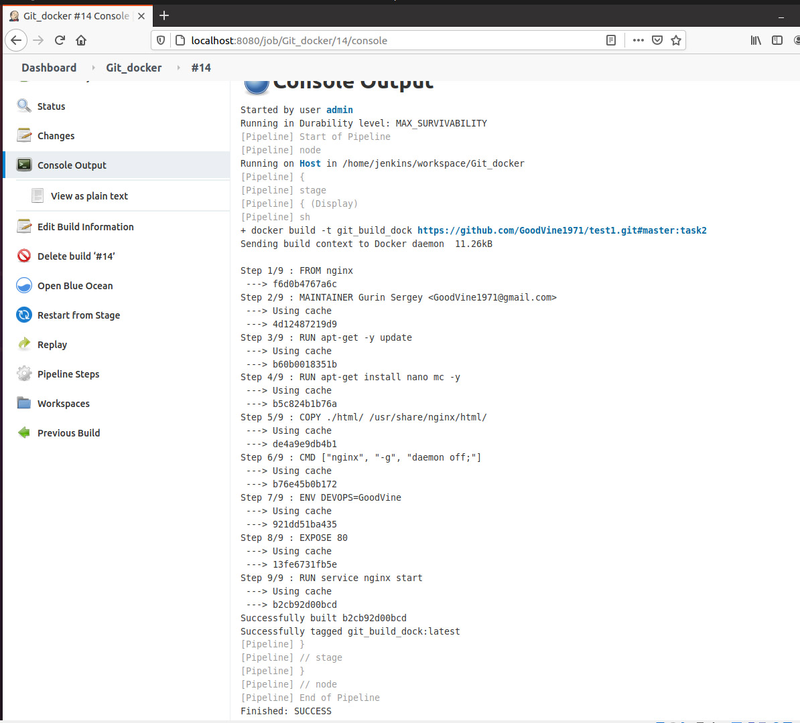
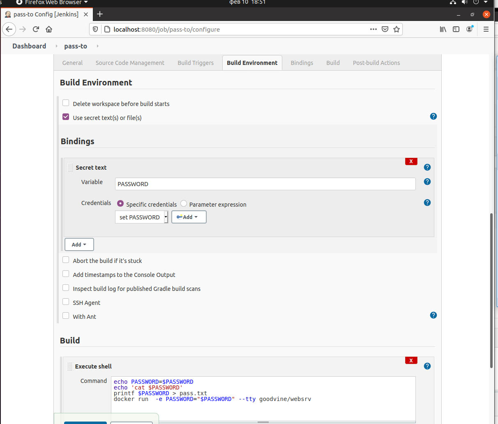
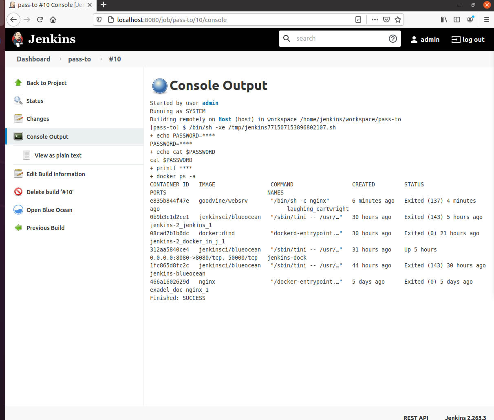
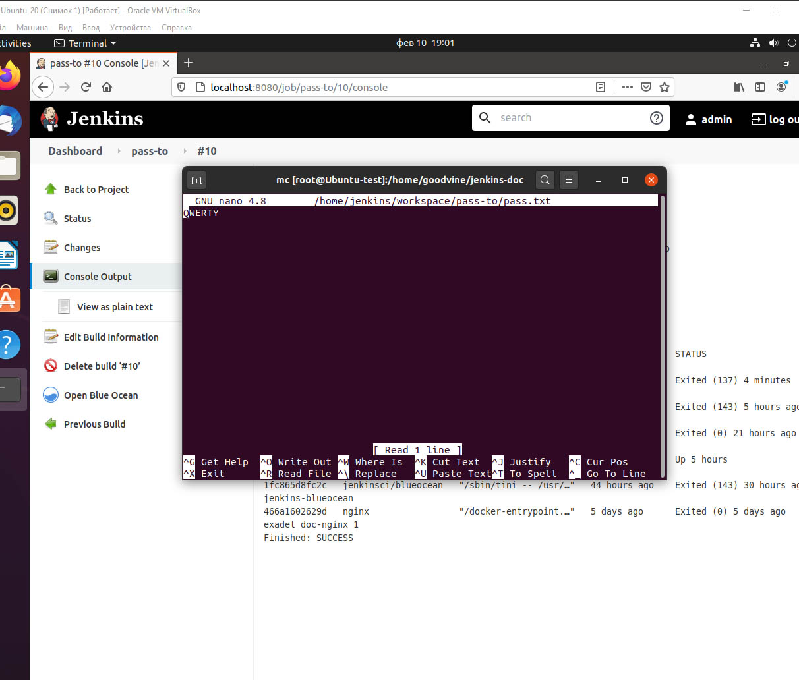

#  Выполнение задания Task4 (Jenkins)  #  
  
 
##  Установка  Jenkins  ## 

Устанавливаем сеть 
>	docker network create jenkins  

Сначала устанавливал по мануалу https://www.jenkins.io/doc/book/installing/docker/
Причем jenkins-blueocean уже есть в репозитории, поэтому следующую установку делал из docker-compose: 
см файл docker-compose.yml

После установки Jenkins открываем http://localhost:8080/
первый раз потребует пароль
>	cat /var/jenkins_home/secrets/initialAdminPassword  копируем - вставляем в web-interface  

Я использовал вход под admin? поэтому сразу поменял пароль на удобный 

Из плагинов к дефолтным добавил git и в предыдущей установке green ball :)

Контейнер стоит в запуске. Но можно запустить и вручную
docker start jenkins-dock 

Чтобы не вводить sudo добавил пользователя в группу docker
>	 usermod -aG docker $USER

Туда же добавил созданного пользователя jenkins

##  Настройка  билд агента  для подключения к хосту ## 

 
Заходим под root в контейнер jenkins
>	docker exec -it --user root jenkins-dock  /bin/bash  

Переходим в пользователя    jenkins
 su - jenkins
 и генерируем ключи
 ssh-keygen
 вставляем на хост public ssh ключ:
 ssh-copy-id jenkins@172.17.0.1
где  (ip узнаем на хосте : > ip addr
видим 172.17.0.1 )
	
	В GUI  выбираем Manage Credentials
Добавляем сертификат privat key из : 
>  cat /var/jenkins_home/.ssh/id_rsa

Заходим в Nodes, создаем новый узел Host
включаем верификацию по ключу

  

##  Freestyle project ## 

Новый Job: Time

В shell:

>	time_now=$(date  +%Y-%m-%d\ %H:%M:%S)
>	echo $time_now

  

##  Pipeline который будет на хосте выполнять команду docker ps -a ## 

Создаю Pipeline Docker_ps со скриптом

pipeline {
    agent any

    stages {
        stage('Display') {
            steps {
                sh 'docker ps -a'
                
                
            }
        }
    }
}

  

##  Pipeline собирает докер образ из вашего Dockerfile на GitHub  ##

Создаю Pipeline Git_docker со скриптом

pipeline {
    agent any

    stages {
        stage('Display') {
            steps {
                
                sh 'docker build -t git_build_dock https://github.com/GoodVine1971/test1.git#master:task2'
             }
        }
    }
}

  

##  Передать переменную PASSWORD=QWERTY  ##

Использую Freestyle : pass-to

В ном создаю переменную PASSWORD  как secret text

 
 
 В итоге получилось передать на host в bash пароль скрыт *****
 
 
 
 А в файлике pass.txt он уже в открытом виде

 
 
 Если использовать Pipeline, то в коде будет
 >	steps { withCredentials([string(credentialsId: '1', variable: 'PASSWORD')]) {
                sh 'docker run  -e PASSWORD="$PASSWORD" --tty goodvine/websrv'
            }