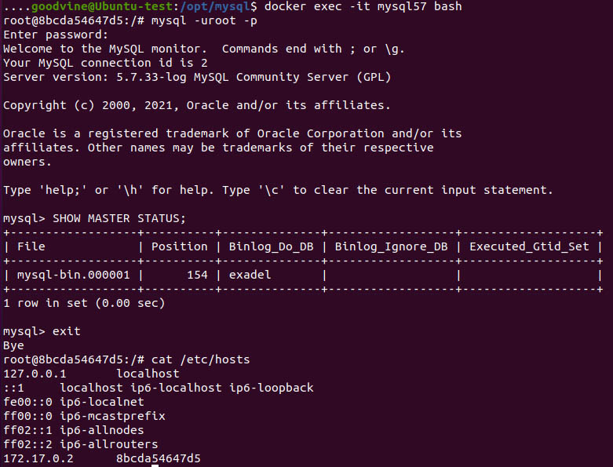

#  Выполнение задания Task5 (Databases)  #  

##   1   ##

Модели баз данных:
- иерархическая (один ко многим);
- сетевая (многие ко многим);
- реляционная (задаются отношения).
- объектно-ориентированные
- документоориентированные

Реляционные базы данных используют структурированный язык запросов (Structured Query Language, SQL) и имеют форму таблиц.
В нереляционной NoSQL БД данные представляются в виде документов, пар «ключ-значение», графов или хранилищ wide-column.
Здесь можно создавать документы, не задавая их структуру заранее; каждый документ может обладать собственной структурой; у каждой базы данных может быть собственный синтаксис; можно добавлять поля прямо во время работы с данными.
Примерами SQL БД являются ySQL, Oracle, PostgreSQL и Microsoft SQL Server, а NoSQL БД - MongoDB, BigTable, Redis, RavenDB Cassandra, HBase, Neo4j и CouchDB

Кратко и доступно здесь: https://tproger.ru/translations/sql-vs-nosql/


##   2 Развернуть в контейнере базу данных MySQL  ##

Подготавливаем папку для создания контейнера и хранения базы.
 
```sh
sudo mkdir /opt/mysql
sudo cd /opt/mysql
sudo mkdir mysql_db
sudo nano docker-compose.yaml
``` 
Создаем docker-compose файл:

	version: '3.5'
	services:
	  db:
	#	build: 
	#	  context: .
	#	  dockerfile: Dockerfile
	    image: mysql:5.7
		container_name: "mysql_5.7"
	    restart: always
		environment:
		  MYSQL_ROOT_PASSWORD: rootpass
		  MYSQL_DATABASE: exadel
		  MYSQL_USER: stud
		  MYSQL_PASSWORD: studpass
		ports:
		  - "3306:3306"
		volumes:
		  - /opt/mysql/mysql_db:/var/lib/mysql
		  - /opt/mysql/files:/var/lib/mysql-files
	#	  - /opt/mysql/conf:/etc/mysql/mysql.conf.d
	  

Как оказалось MySQL server is running with the --secure-file-priv option  и файлы можно класть только сюда:
 /var/lib/mysql-files  ,  проверяется командой SHOW VARIABLES LIKE "secure_file_priv";
 Можно, конечно, изменить  секцию [mysqld] и добавить строку:  ```secure-file-priv = "" ```,
 но оставим по-умолчанию, а на будущее оставил закоментированной строку с конфигом mysql. 
	Прим.: если на хосте (не в докере) работает mysql на 3306, то будет ошибка, так как порт 3306 уже занят, тогда нужно выбрать другой порт 3307:3306.
	
В подпапке /files  лежат stud.csv, res.csv, base.sql  для импорта базы данных из csv и готовый mysql-скрипт.
 
Запускаем docker-compose и создаем контейнер:	 

```sh
docker-compose up -d
```
Заходим внутрь контейнера и запускаем консоль mysql с кредами, указанными в environment:
```sh
docker exec -it mysql_5.7  bash
mysql -uroot -prootpass
```
> SHOW DATABASES;  
 
  

Здесь видна уже созданная база exadel

##   3 Заполнить базу данных.  ##

Как указано выше для заполнения базы данных созданы 3 файла stud.csv, res.csv, base.sql

1. Создание базы из консоли и импортирование данных из csv.

	Подключаемся к базе exadel с пользователем stud:
	```sh
	mysql -u stud -p exadel
	```
	> use exadel 
	
	Создаем структуру базы:
	
	CREATE TABLE `Students` (
	  `ID` tinyint unsigned NOT NULL AUTO_INCREMENT,
	  `Student` char(40) NOT NULL,
	   PRIMARY KEY (`ID`)
	) ENGINE=InnoDB DEFAULT CHARSET=utf8;

	CREATE TABLE `Result` (
	  `ID` tinyint  unsigned NOT NULL AUTO_INCREMENT,
	  `StudentId` tinyint unsigned NOT NULL,
	  `Task1` char(15) NOT NULL,
	  `Task2` char(15) NOT NULL,
	  `Task3` char(15) NOT NULL,
	  `Task4` char(15) NOT NULL,
	   PRIMARY KEY (`ID`)
	) ENGINE=InnoDB DEFAULT CHARSET=utf8;
	

	Импортируем из csv файлов  (должны быть в utf8)
	
	LOAD DATA INFILE '/var/lib/mysql-files/stud.csv'
	INTO TABLE Students
	FIELDS TERMINATED BY ';'
	ENCLOSED BY '"'
	LINES TERMINATED BY '\n'
	IGNORE 1 ROWS;	

	LOAD DATA INFILE '/var/lib/mysql-files/res.csv'
	INTO TABLE Result
	FIELDS TERMINATED BY ';'
	ENCLOSED BY '"'
	LINES TERMINATED BY '\n'
	IGNORE 1 ROWS;

	  

	Подключаемся с хоста:
	Прокинул порт с виртуалки на стационарный компьютер, подключился к база на Доккере через HeidiSQL:
	
	Таблица Students:
	
	  

	Таблица Result:
	
	  
	

2.    3*  SQL скрипт.  

	\mysql\files\base.sql
	Удаляем таблицы из базы  
	
	> DROP TABLE Students;
	> DROP TABLE Result; 
	
Импорт из sql файла bash:
```sh
mysql -uroot -p exadel < /var/lib/mysql-files/base.sql
```
	
  
	
	
##  4  Написать запрос который по вашей фамилии будет находить информацию   ##

В консоли mysql не вводятся буквы на русской раскладке

Посмотрел character_set, заменил на utf8. 

> SHOW VARIABLES LIKE 'char%';

```sh
cd /etc/mysql/mysql.conf.d
nano mysqld.cnf
```

	[client]
	default-character-set = utf8
	[mysqld]
	character-set-server=utf8
	collation-server=utf8_general_ci
	init-connect="SET NAMES utf8"
	skip-character-set-client-handshake
	[mysql]
	default-character-set = utf8
	[mysqldump]
	default-character-set = utf8

Выводить русские символы стало правильно, но ввод не появился.

Поэтому выполнил в менеджере MySQL

SELECT Students.Student, Result.Task1, Result.Task2, Result.Task3, Result.Task4  FROM Students  
INNER JOIN Result ON Students.ID = Result.StudentId 
WHERE Students.Student LIKE '%Гурин%' ;

  


##  5  Настроить репликацию SQL базы данных (Master->Slave)  ##


```sh
sudo mkdir /opt/mysql-slave
```
Поднимаем второй контейнер через  
 в папке /opt/mysql-slave , изменив строки

container_name: "mysql_slave"
ports:
      - "3307:3306"
 volumes:
	  - /opt/mysql-slave/mysql_db:/var/lib/mysql
	  
По умолчанию, если не указана сеть в docker файле - контейнеры изолированы.

Поэтому добавляем строку:  network_mode: "bridge"
	  
	На главном сервере отредактируем файл файл my.cnf, в секцию [mysqld] добавить строки:
	##### выбираем ID сервера, произвольное число, лучше начинать с 1
	server-id = 1

	##### путь к бинарному логу
	log_bin = /var/log/mysql/mysql-bin.log

	##### название реплицируемой базы данных
	binlog_do_db = exadel

перезапускаем: service mysql restart

Создаем пользователя replicator:

> GRANT REPLICATION SLAVE ON *.* TO 'replicator'@'%' IDENTIFIED BY 'pass';
> FLUSH PRIVILEGES;

Проверяем статус Мастер-сервера:

> SHOW MASTER STATUS;

 

Ок, работает

На Slave сервере отредактируем файл файл my.cnf, в секцию [mysqld] добавить строки:

##### ID Слейва, удобно выбирать следующим числом после Мастера
server-id = 2

##### Путь к relay логу
relay-log = /var/log/mysql/mysql-relay-bin.log

##### Путь к bin логу на Мастере
log_bin = /var/log/mysql/mysql-bin.log

##### База данных для репликации
binlog_do_db = exadel

После перезагрузки в консоли mysql выполняем:

> CHANGE MASTER TO MASTER_HOST='172.17.0.3', MASTER_PORT=3306, MASTER_USER='replicator', MASTER_PASSWORD='pass';
> SHOW SLAVE STATUS\G;

  

Возможны ошибки соединенния: проверяем удаленное соединение mysql от slave к master
Можно посмотреть log подключения в docker:

```sh
docker logs -f mysql_slave
```
Или ошибка репликации из-зп одинакового  UUID, тогда удаляем auto.cnf

mysql> STOP SLAVE;  

```sh
service mysql stop
mv /var/lib/mysql/auto.cnf /var/lib/mysql/auto.cnf.bak
service mysql start
```
mysql> START SLAVE;

В Mysql менеджере  на мастере добавляем нового студента, смотрим slave - там тоже добавился.

  


##  6,  7 добавить переменную USERNAME, выполнить поиск  ##

Для переменной USERNAME добавляем в environment строку:
     
>	USERNAME: 14

Использовал ID , т.к. в консоли mysql не передается русский

Выполняем из bash, т.к. переменной в консоли mysql нет:

```sh
mysql -uroot -p${MYSQL_ROOT_PASSWORD}  -e  "use exadel; SELECT Student FROM Students WHERE ID=${USERNAME};"
```
Или так, если строка длинная.

```sh
mysql -uroot -p${MYSQL_ROOT_PASSWORD} <<EOF
use exadel
SELECT Student FROM Students WHERE ID=${USERNAME}
EOF
```
Добавляем вывод результатов тестов:

```sh
mysql -uroot -p${MYSQL_ROOT_PASSWORD}  -e  "use exadel;
SELECT Students.Student, Result.Task1, Result.Task2, Result.Task3, Result.Task4  FROM Students  
INNER JOIN Result ON Students.ID = Result.StudentId 
WHERE Students.ID = ${USERNAME} ;"
```
 

##  8  NoSQL (Mongodb)   ##

Ищем в репозитории:
```sh
docker search mongodb
```
Создаем в /opt директории и docker-compose.yaml:
```sh
mkdir -pv mongodb/database
sudo nano docker-compose.yaml
```
	version: '3.5'
	services:
	  mongodb:
		image: mongo
		container_name: mongodb
		restart: unless-stopped
		environment:
		  MONGO_INITDB_ROOT_USERNAME: root
		  MONGO_INITDB_ROOT_PASSWORD: pass
		ports:
		  - 27017:27017
		network_mode: "bridge"
		volumes:
		  - /opt/mongodb/database:/data/db
	
Запускаем контейнер и заходим в него:
```sh 	
docker-compose up -d
docker exec -it mongodb bash
```

Входим в консоль: mongo

Авторизация:
> db.auth('root', 'pass');  

Создаем базу:
> use exadel  

Создаем коллекцию:
>db.createCollection("Students")  


Для репликации создадим сеть mongo
```sh 	
docker network create mongo
```
Поднимаем 3 контейнера (см mongodb/docker-compose.yaml)

Смотрим ip:
```sh 	
docker network inspect mongo
```
Прописываем соответственно именам контейнеров в hosts для обращения по имени контейнера:

	172.24.0.2      mongo1
	172.24.0.3      mongo2
	172.24.0.4      mongo3

Заходим в первый контейнер:
```sh 
docker exec -it mongo1 bash
mongo
```
Инициируем репликасет:

> rs.initiate()
> db.isMaster()

Видим называется:  rs0:PRIMARY

Добавляем в репликасет mongo2
> rs.add("mongo2:27017")

Mongo3 будет арбитром
> rs.add("mongo3:27017", {arbiterOnly: true}) 

Проверка статуса:
> rs.status()

Добавим базу и коллекцию:

> use exadel
> db.createCollection("Students")  


Подключаемся к базам. Репликация работает:

 


Для переменной добавим 

Для переменной USERNAME добавляем в в docker-compose.yaml строку в environment :
     
>	USERNAME: Гурин  

Проверяем в bash

```sh
echo $USERNAME - выводим в bash
```


##  9  Написать Ansible роль для создания SQL кластера   ##

В качестве кластера возьмем  MySQL Cluster 8.0.23 
https://dev.mysql.com/doc/refman/8.0/en/mysql-cluster-installation.html

на каждой машине создадим пользователя mysql и группу mysql

```sh
useradd -m -s /bin/bash mysql
passwd mysql
usermod -aG mysql mysql 
usermod -aG sudo mysql  
```

Будем использовать 3 сервера: 2 с данными (Data node "A" (ndbd) и Data node "B" (ndbd)) и еще один объединит диспетчер кластера и клиент MySQL (Management node (mgmd) и SQL node (mysqld))
Пусть Ip-адреса будут следующие:
192.168.0.10 Data node "A" (ndbd)
192.168.0.20 Data node "B" (ndbd)
192.168.0.1 Management node (mgmd) и SQL node (mysqld)

Ansible установлен на 192.168.0.1 (в task3)

Добавляем ssh ключи на обе машины из кластера:
ssh-copy-id mysql@192.168.0.10
ssh-copy-id mysql@192.168.0.20

Настраиваем /etc/ansible/hosts 

[mysql_cluster_data]
ndb0 ansible_host=mysql@192.168.0.10
ndb1 ansible_host=mysql@192.168.0.20
[mysql_cluster_sql]
ndb0 ansible_host=mysql@192.168.0.1
[mysql_cluster_mgmd]
ndb-mgmd ansible_host=mysql@192.168.0.1

Бинарники для кластера https://dev.mysql.com/downloads/cluster/
Для скачивания создаем аккаунт в Oracle

Создаем playbook:
>	/etc/ansible/palybooks/mysql_cluster.yml

- hosts: mysql_cluster_mgmd
  become: true
  become_method:
    sudo
  roles:
  - mysql-cluster-mgmd

- hosts: mysql_cluster_data
  become: true
  become_method:
    sudo
  roles:
  - mysql-cluster-data

- hosts: mysql_cluster_sql
  become: true
  become_method:
    sudo
  roles:
  - mysql-cluster-sql

Создадим роли в папке /etc/ansible/palybooks/roles
1. Роль mysql_cluster_mgmd
Папка mysql_cluster_mgmd файл main.yaml

		- name: Download deb
		  get_url: 
			url: https://dev.mysql.com/get/Downloads/MySQL-Cluster-8.0/mysql-cluster-community-management-server_8.0.23-1ubuntu20.04_amd64.deb
			dest: /home/goodvine

		- name: install deb
		  command: dpkg -i /home/goodvine/mysql-cluster-community-management-server_8.0.23-1ubuntu20.04_amd64.deb
		 # The .deb file for NDB 8.0 installs NDB Cluster under /opt/mysql/5.7/

		- name: create cluster directory
		  file:
			path: /var/lib/mysql-cluster
			state: directory

		- name: Copy cluster config
		  template: 
			src: config.ini
			dest: /var/lib/mysql-cluster/config.ini

			где  config.ini файл в подпапке templates

			[ndbd default]
			##### Options affecting ndbd processes on all data nodes:
			NoOfReplicas=2    # Number of fragment replicas
			DataMemory=98M    # How much memory to allocate for data storage

			[ndb_mgmd]
			##### Management process options:
			HostName=192.168.0.1          # Hostname or IP address of management node
			DataDir=/var/lib/mysql-cluster  # Directory for management node log files

			[ndbd]
			##### Options for data node "A":
											# (one [ndbd] section per data node)
			HostName=192.168.0.10          # Hostname or IP address
			NodeId=2                        # Node ID for this data node
			DataDir=/usr/local/mysql/data   # Directory for this data node's data files

			[ndbd]
			##### Options for data node "B":
			HostName=192.168.0.20          # Hostname or IP address
			NodeId=3                        # Node ID for this data node
			DataDir=/usr/local/mysql/data   # Directory for this data node's data files

			[mysqld]
			##### SQL node options:
			HostName=192.168.0.1          # Hostname or IP address
											# (additional mysqld connections can be
											# specified for this node for various
											# purposes such as running ndb_restore)

		- name: start first time
		  shell: ndb_mgmd -f /var/lib/mysql-cluster/config.ini
__________________________________

2. Роль mysql_cluster_sql	
	Папка mysql_cluster_sql файл main.yaml
	
  
		- name: Download serv 
		  command: wget --continue -P /var/tmp http://dev.mysql.com/get/Downloads/MySQL-Cluster-8.0/mysql-cluster-gpl-8.0.23-linux-glibc2.12-x86_64.tar.gz  

		- name: Extract tar
		  command: tar -C /usr/local -xzvf mysql-cluster-gpl-8.0.23-linux-glibc2.12-x86_64.tar.gz
		  
		- name: Link directory to short name mysql
		  command: ln -s /usr/local/mysql-cluster-gpl-8.0.23-linux-glibc2.12-x86_64 /usr/local/mysql 

		- name: Change location to the mysql directory
		  shell: cd mysql

		- name: set up the system databases 
		  command: ./scripts/mysql_install_db --user=mysql chdir=/usr/local/mysql/ creates=/usr/local/mysql/data/mysql/user.frm  
			
		- name: Set the necessary permissions for the MySQL server and data 
		  shell: chown -R mysql /usr/local/mysql/data && chgrp -R mysql /usr/local/mysql/

		- name: Install init file
		  command: cp support-files/mysql.server /etc/rc.d/init.d/
		- name: Set permissions  
		  command: chmod +x /etc/rc.d/init.d/mysql.server
		- name: Set chkconfig 
		  command: chkconfig --add mysql.server  
		  
		- name: Install my.cnf 
		  template: src=my.cnf dest=/etc/my.cnf
  
 где  my.cnf  файл в подпапке templates 
 
[mysqld]
##### Options for mysqld process:
ndbcluster                      # run NDB storage engine

[mysql_cluster]
##### Options for NDB Cluster processes:
ndb-connectstring=198.51.100.10  # location of management server
 
Вот на этом месте я выяснил, что надо было не кластер на нодах поднимать, а использовать репликацию, сделанную выше.
__________________________________

##  9  Написать Ansible роль для создания SQL кластера  (попытка номер 2) ##

Сначала задачу усложнил, значит теперь упрощаю. За отсутствием времени выполнено теоретически.

Итак, при условии, что контейнеры уже установлены и запущены:

Настраиваем /etc/ansible/hosts 

[cluster-master]  
        master ansible_host=172.17.0.3 
[cluster-slave] 		
        slave ansible_host=172.17.0.2
		
Подготавливаем 2 файла my.cnf, первый для master: 

			includedir /etc/mysql/conf.d/
			!includedir /etc/mysql/mysql.conf.d/

			[client]
			default-character-set = utf8
			[mysqld]
			server-id = 1
			log_bin = /var/log/mysql/mysql-bin.log
			binlog_do_db = exadel

			character-set-server=utf8
			collation-server=utf8_general_ci
			init-connect="SET NAMES utf8"
			skip-character-set-client-handshake
			[mysql]
			default-character-set = utf8
			[mysqldump]
			default-character-set = utf8	
			
Второй для slave

			!includedir /etc/mysql/conf.d/
			!includedir /etc/mysql/mysql.conf.d/

			[client]
			default-character-set = utf8
			[mysqld]
			server-id = 2
			relay-log = /var/log/mysql/mysql-relay-bin.log
			log_bin = /var/log/mysql/mysql-bin.log
			binlog_do_db = exadel

			character-set-server=utf8
			collation-server=utf8_general_ci
			init-connect="SET NAMES utf8"
			skip-character-set-client-handshake
			[mysql]
			default-character-set = utf8
			[mysqldump]
			default-character-set = utf8
			

Пишем роль для cluster-master:

			- name: Install config
			  template: src=my.cnf dest=/etc/my.cnf
			  notify: restart mysql

			- name: Insert user replicator
			  command: mysql -uroot -p${MYSQL_ROOT_PASSWORD}  -e  " GRANT REPLICATION SLAVE ON *.* TO 'replicator'@'%' IDENTIFIED BY 'pass'; FLUSH PRIVILEGES;"

			  handlers:
			  - name: restart mysql
				  service: name=mysql
						   enabled=yes
						   state=restarted

Пишем роль для cluster-slave:

			- name: Install config
			  template: src=my.cnf dest=/etc/my.cnf
			  notify: restart mysql

			- name: Insert user replicator
			  command: mysql -uroot -p${MYSQL_ROOT_PASSWORD}  -e  " CHANGE MASTER TO MASTER_HOST='172.17.0.3', MASTER_PORT=3306, MASTER_USER='replicator', MASTER_PASSWORD='pass';"

			  handlers:
			  - name: restart mysql
				  service: name=mysql
						   enabled=yes
						   state=restarted
  
  
##  10  Написать Ansible роль для создания NoSQL кластера  ##  

Допущение: 3 контейнера с MongoDB запущены как выполнялось выше.
Иначе необходимо добавть роль Install_Mongo_Docker, в которой нужно установить сеть, запустить контейнеры из docker-compose

[mongodb_serv]

			- name: Initiate replicaSet
			  command: mongo --eval 'rs.initiate()'
			- name: Ждем 30 сек
			  command: sleep 30  
			-name: It is master
			  command: mongo --eval 'db.isMaster()'
			-name: It is slave
			  command: mongo --eval 'rs.add("mongo2:27017")'
			-name: It is arbitr
			  command: mongo --eval 'rs.add("mongo3:27017", {arbiterOnly: true})'


##  11  Написать Groovy Pipeline для Jenkins который будет запускать ансибл плейбуки для SQL/NoSQL  ##  


pipeline {
    agent any

    stages {
        stage('Display') {
            steps {
                sh 'ansible-playbook  /opt/mysql/ansible/cluster_mysql.yaml'
				
            }
        }
    }
}  
  
 где в  cluster_mysql.yaml описаны роли для cluster-master и cluster-slave

 
