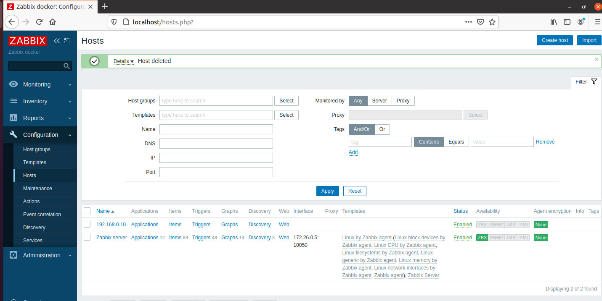
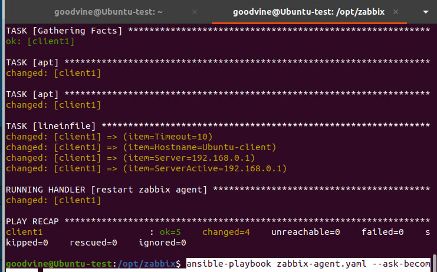
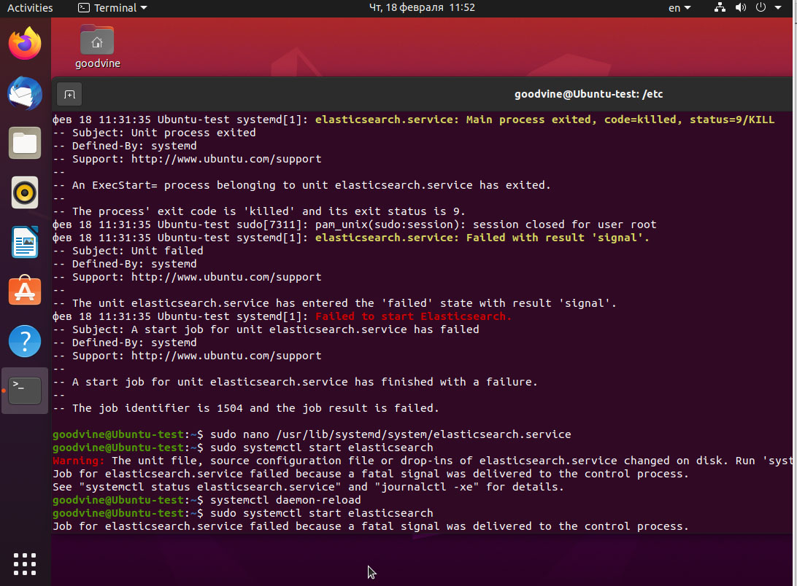

#  Выполнение задания Task6 (Logging&Monitoring)  #  

##   ZABBIX   ##

###  1.1 Установить на сервер - сконфигурировать веб и базу ###

Для установки на хост переходим на страницу загрузки https://www.zabbix.com/download и выбераем репозиторий, соответствующий дистрибутиву Linux. 

Для Ubuntu20.04 получаем команды установки репозитория:

```sh
 wget https://repo.zabbix.com/zabbix/5.2/ubuntu/pool/main/z/zabbix-release/zabbix-release_5.2-1+ubuntu20.04_all.deb
 dpkg -i zabbix-release_5.2-1+ubuntu20.04_all.deb
 apt update
``` 

Установка Zabbix server, frontend, agent
Почему-то в зависимостях нет mysql сервера и zabbix-server-mysql не поднимает сервер , поэтому добавим в строку установки mariadb-server
```sh
apt install mariadb-server zabbix-server-mysql zabbix-frontend-php zabbix-nginx-conf zabbix-agent
````

Но сделаем установку в контейнере docker.

На https://www.zabbix.com/container_images можно выбрать нужный образ.

Добавим docker сеть для zabbix:
```sh
docker network create zabbix
docker network inspect zabbix 
```

Создаем в /opt рабочую диресторию zabbix, папку mysql для проброса базы и и docker-compose.yaml:

```sh
mkdir -pv zabbix/mysql
sudo nano docker-compose.yaml
```
(Установка в docker сопровождалась сложностями с настройкой сети и портов, т.к. в образах внутренние порты изменены.)

Заходим в браузере: 

	По-умолчанию 
	Логин: Admin  (именно сбольшой буквы)
	Пароль zabbix

Смотрим ip агента:
```sh
docker inspect zabbix-agent | grep "IPAddress\": "
```
>	172.26.0.5

вставляем вместо 127.0.0.1 в настойках агента дефолтного хоста Zabbix server

  


###  1.2 Поставить на подготовленные ранее сервера или виртуалки заббикс агенты  ###


Установим агента на виртуальную машину при помощи ansible

Добавляем  в /etc/ansible/hosts 
 [ubuntu]
  client1 ansible_host=ansclient@192.168.0.10
  client2 ansible_host=ansclient@192.168.0.20
		
Создаем  ansible-agent.yaml следующего содержания 

		---

		- name: Install zabbix agent
		  hosts: client1
		  become:
			true
		  become_method:
			sudo
		  tasks:

			- apt:
				deb: https://repo.zabbix.com/zabbix/5.2/ubuntu/pool/main/z/zabbix-release/zabbix-release_5.2-1+ubuntu20.04_all.deb
			  
			- apt:
				name: zabbix-agent
				update_cache: yes
			 

			- lineinfile:
				path: "/etc/zabbix/zabbix_agentd.conf"
				regexp: "^{{ item.split('=')[0] }}="
				line: "{{ item }}"
			  with_items:
				- "Timeout=10"
				- "Hostname=Ubuntu-client"
				- "Server=192.168.0.1"
				- "ServerActive=192.168.0.1"
			  notify:
				- restart zabbix agent
		 
		  handlers:

			- name: restart zabbix agent
			  command: /bin/systemctl restart zabbix-agent

Выполняем :
```sh
 ansible-playbook zabbix-agent.yaml --ask-become-pass
```

 


Установим агента для mysql57 из task5 он находится на том же хосте, что и zabbix? но в сети bridge:

В сети bridge не работает link

docker network create mysql_repl

docker network disconnect bridge mysql57
docker network disconnect bridge mysql_slave
docker network connect mysql_repl mysql57
docker network connect mysql_repl mysql_slave

Создаем контейнер с агентом для mysql57

docker run --name zabbix-agent2 -v /opt/zabbix/agent:/etc/zabbix/zabbix_agentd.d --network mysql_repl  --link mysql57:mysql57 -e ZBX_HOSTNAME="mysql57" -e ZBX_SERVER_HOST="192.168.0.1" -d zabbix/zabbix-agent

создаем файл template_db_mysql.conf в /opt/zabbix/agent:

UserParameter=mysql.ping[*], mysqladmin -h"$1" -P"$2" ping
UserParameter=mysql.get_status_variables[*], mysql -h"$1" -P"$2" -sNX -e "show global status"
UserParameter=mysql.version[*], mysqladmin -s -h"$1" -P"$2" version
UserParameter=mysql.db.discovery[*], mysql -h"$1" -P"$2" -sN -e "show databases"
UserParameter=mysql.dbsize[*], mysql -h"$1" -P"$2" -sN -e "SELECT COALESCE(SUM(DATA_LENGTH + INDEX_LENGTH),0) FROM INFORMATION_SCHEMA.TABLES WHERE TABLE_SCHEMA='$3'"
UserParameter=mysql.replication.discovery[*], mysql -h"$1" -P"$2" -sNX -e "show slave status"
UserParameter=mysql.slave_status[*], mysql -h"$1" -P"$2" -sNX -e "show slave status"

В  /opt/zabbix/conf создаем:
# cat /var/lib/zabbix/.my.cnf
[client]
user = zabbix
password = zabbix

В контейнере mysql добавляем нового пользователя:

mysql -uroot -p
> CREATE USER 'zabbix'@'%' IDENTIFIED BY 'zabbix';
> GRANT USAGE,REPLICATION CLIENT,PROCESS,SHOW DATABASES,SHOW VIEW ON *.* TO 'zabbix'@'%';


перезапускае контейнер zabbix-agent2

В контейнере mysql 


docker run --name zabbix-agent2- -v /opt/zabbix/conf:/etc/zabbix/zabbix_agentd.d --link mysql-server:mysql-server --link zabbix-server:zabbix-server -e ZBX_HOSTNAME="Zabbix server" -e ZBX_SERVER_HOST="zabbix-server" -d zabbix/zabbix-agent


docker run --name some-zabbix-agent -e ZBX_HOSTNAME="some-hostname" -e ZBX_SERVER_HOST="some-zabbix-server" -d zabbix/zabbix-agent:latest
Получаем:
docker run --name zabbix-agent -e ZBX_HOSTNAME="ZabbixServ" -e ZBX_SERVER_HOST="192.168.0.1" -d zabbix/zabbix-agent:latest


docker run --name zabbix-server --link zabbix-agent:zabbix-agent2 -d zabbix/zabbix-server:latest


docker run --name zabbix-server --link zabbix-agent:zabbix-agent -d zabbix/zabbix-server:latest


##   ELK   ##

###  2.1 Установить и настроить ELK  ###

sudo apt update
Ставим nginx и https-transport

sudo apt install nginx install apt-transport-https -y

sudo nano /etc/nginx/sites-available/elk

sudo ln -s /etc/nginx/sites-available/elk /etc/nginx/sites-enabled/elk

Установка виртуальной машины Java Java Runtime Environment (JRE).
sudo apt install default-jre -y
и компилятор JDK 
sudo apt install default-jdk -y

Java Runtime Environment (JRE).
Импортируем открытый ключ GPG Elasticsearch, с использованием которого защищаются пакеты Elastic, выполнив команду: 

sudo wget -qO - https://artifacts.elastic.co/GPG-KEY-elasticsearch | sudo apt-key add 

Добавляем репозиторий Elasticsearch в систему:

sudo echo "deb https://artifacts.elastic.co/packages/7.x/apt stable main" | sudo tee -a /etc/apt/sources.list.d/elastic-7.x.list

sudo apt update

Установка Elasticsearch

sudo apt install elasticsearch

Редактируем главный файл конфигурации Elasticsearch
sudo nano /etc/elasticsearch/elasticsearch.yml
задаем:
network.host: localhost
port: 9200
Добавляем в автозапуск:

sudo systemctl enable elasticsearch

Запускаем:
systemctl daemon-reload 
sudo systemctl enable elasticsearch.service 
sudo systemctl start elasticsearch

Из-за ошибок fatal signal was delivered to the control process пришлось устанавливать на новую виртуалку.
  

Проверяем: 
sudo systemctl status elasticsearch
curl -X GET "localhost:9200"

Частая ошибка: elasticsearch.service: Failed with result 'timeout'.
Немного помогло 
sudo systemctl edit --full elasticsearch.service
и установка  TimeoutStartSec=180
Но, похоже и этого мало

Далее устанавливаем  Kibana

sudo apt install kibana

sudo nano /etc/kibana/kibana.yml раскоментируем server.port, server.host и elasticsearch.hosts: 

Запускаем службу
sudo systemctl enable kibana
sudo systemctl start kibana
Проверяем статус:
systemctl status kibana.service

Вводим админа:

echo "admin:`openssl passwd -apr1`" | sudo tee -a /etc/nginx/htpasswd.users
http://localhost:5601

Установка Logstash 

sudo apt install logstash

sudo nano /etc/logstash/conf.d/beats-input.conf
input {
beats {
port => 5044
}
}

sudo nano /etc/logstash/conf.d/elasticsearch-output.conf
output {
if [@metadata][pipeline] {
elasticsearch {
hosts => ["localhost:9200"] manage_template => false
index => "%{[@metadata][beat]}-%{[@metadata][version]}-%{+YYYY.MM.dd}"
pipeline => "%{[@metadata][pipeline]}"
}
} else {
elasticsearch {
hosts => ["localhost:9200"] manage_template => false
index => "%{[@metadata][beat]}-%{[@metadata][version]}-%{+YYYY.MM.dd}"
}
}
}


Проверим конфигурацию Logstash:

sudo -u logstash /usr/share/logstash/bin/logstash --path.settings /etc/logstash -t

если OK pапускаем  Logstash:

sudo systemctl start logstash
sudo systemctl enable logstash

Установим Filebeat.

sudo apt install filebeat

sudo nano /etc/filebeat/filebeat.yml

Комментируем output.elasticsearch и открываем output.logstash/bin/logstash

Включаем модуль
sudo filebeat modules enable system
sudo filebeat modules enable logstash
Посмотреть все модули:
sudo filebeat modules list

шаблон индекса Elasticsearch
sudo filebeat setup --template -E output.logstash.enabled=false -E 'output.elasticsearch.hosts=["localhost:9200"]'
Дашборды позволяют визуализировать данные Filebeat отсылаемые в Kibana. Для включения дашборда
sudo filebeat setup -E output.logstash.enabled=false -E output.elasticsearch.hosts=['localhost:9200'] -E setup.kibana.host=localhost:5601

Запуск и автозагрузка:
systemctl start filebeat
systemctl enable filebeat

заходим 192.168.0.10

Вводим 