#  Выполнение задания Task6 (Logging&Monitoring)  #  

##   ZABBIX   ##

###  1.1 Установить на сервер - сконфигурировать веб и базу ###

Для установки на хост переходим на страницу загрузки https://www.zabbix.com/download и выбераем репозиторий, соответствующий дистрибутиву Linux. 

Для Ubuntu20.04 получаем команды установки репозитория:

```sh
 wget https://repo.zabbix.com/zabbix/5.2/ubuntu/pool/main/z/zabbix-release/zabbix-release_5.2-1+ubuntu20.04_all.deb
 dpkg -i zabbix-release_5.2-1+ubuntu20.04_all.deb
 apt update
``` 

Установка Zabbix server, frontend, agent
Почему-то в зависимостях нет mysql сервера и zabbix-server-mysql не поднимает сервер , поэтому добавим в строку установки mariadb-server
```sh
apt install mariadb-server zabbix-server-mysql zabbix-frontend-php zabbix-nginx-conf zabbix-agent
````

Но сделаем установку в контейнере docker.

На https://www.zabbix.com/container_images можно выбрать нужный образ.

Добавим docker сеть для zabbix:
```sh
docker network create zabbix
docker network inspect zabbix 
```

Создаем в /opt рабочую диресторию zabbix, папку mysql для проброса базы и и docker-compose.yaml:

```sh
mkdir -pv zabbix/mysql
sudo nano docker-compose.yaml
```
(Установка в docker сопровождалась сложностями с настройкой сети и портов, т.к. в образах внутренние порты изменены.)

Заходим в браузере: 

	По-умолчанию 
	Логин: Admin  (именно сбольшой буквы)
	Пароль zabbix

Смотрим ip агента:
```sh
docker inspect zabbix-agent | grep "IPAddress\": "
```
>	172.26.0.5

вставляем вместо 127.0.0.1 в настойках агента дефолтного хоста Zabbix server

  


###  1.2 Поставить на подготовленные ранее сервера или виртуалки заббикс агенты  ###


Установим агента на виртуальную машину при помощи ansible

Добавляем  в /etc/ansible/hosts 
 [ubuntu]
  client1 ansible_host=ansclient@192.168.0.10
  client2 ansible_host=ansclient@192.168.0.20
		
Создаем  ansible-agent.yaml следующего содержания 

		---

		- name: Install zabbix agent
		  hosts: client1
		  become:
			true
		  become_method:
			sudo
		  tasks:

			- apt:
				deb: https://repo.zabbix.com/zabbix/5.2/ubuntu/pool/main/z/zabbix-release/zabbix-release_5.2-1+ubuntu20.04_all.deb
			  
			- apt:
				name: zabbix-agent
				update_cache: yes
			 

			- lineinfile:
				path: "/etc/zabbix/zabbix_agentd.conf"
				regexp: "^{{ item.split('=')[0] }}="
				line: "{{ item }}"
			  with_items:
				- "Timeout=10"
				- "Hostname=Ubuntu-client"
				- "Server=192.168.0.1"
				- "ServerActive=192.168.0.1"
			  notify:
				- restart zabbix agent
		 
		  handlers:

			- name: restart zabbix agent
			  command: /bin/systemctl restart zabbix-agent

Выполняем :
```sh
 ansible-playbook zabbix-agent.yaml --ask-become-pass
```

 

Аналогично устанавливаю агента для Client2

Установим агента для mysql57 из task5 он находится на том же хосте, что и zabbix, но в сети bridge:

В сети bridge не работает link? поэтому создаем новую пользовательскую сеть и переключаем контейнеры с mysql на эту сеть: 
```sh
docker network create mysql_repl

docker network disconnect bridge mysql57
docker network disconnect bridge mysql_slave
docker network connect mysql_repl mysql57
docker network connect mysql_repl mysql_slave
```
Создаем контейнер с агентом для mysql57

docker run --name zabbix-agent2 -v /opt/zabbix/agent:/etc/zabbix/zabbix_agentd.d --network mysql_repl  --link mysql57:mysql57 -e ZBX_HOSTNAME="mysql57" -e ZBX_SERVER_HOST="192.168.0.1" -d zabbix/zabbix-agent


Можно создать файл template_db_mysql.conf в /opt/zabbix/agent:, подключенный к /etc/zabbix/zabbix_agentd.d  идобавить дополнительные параметры: 

	UserParameter=mysql.ping[*], mysqladmin -h"$1" -P"$2" ping
	UserParameter=mysql.get_status_variables[*], mysql -h"$1" -P"$2" -sNX -e "show global status"
	UserParameter=mysql.version[*], mysqladmin -s -h"$1" -P"$2" version
	UserParameter=mysql.db.discovery[*], mysql -h"$1" -P"$2" -sN -e "show databases"
	UserParameter=mysql.dbsize[*], mysql -h"$1" -P"$2" -sN -e "SELECT COALESCE(SUM(DATA_LENGTH + INDEX_LENGTH),0) FROM INFORMATION_SCHEMA.TABLES WHERE TABLE_SCHEMA='$3'"
	UserParameter=mysql.replication.discovery[*], mysql -h"$1" -P"$2" -sNX -e "show slave status"
	UserParameter=mysql.slave_status[*], mysql -h"$1" -P"$2" -sNX -e "show slave status"

создаем:
 /var/lib/zabbix/.my.cnf

	[client]
	user = zabbix
	password = zabbix

В контейнере mysql добавляем нового пользователя:
```sh
mysql -uroot -p
```
> CREATE USER 'zabbix'@'%' IDENTIFIED BY 'zabbix';
> GRANT USAGE,REPLICATION CLIENT,PROCESS,SHOW DATABASES,SHOW VIEW ON *.* TO 'zabbix'@'%';

перезапускаем онтейнер zabbix-agent2

К сожалению я пока не разобрался как маршрутизировать запрос оз одной docker сети в другую. Возможно нужно было создавать в одной сети или использовать тип Overlay или Host

Поэтому я поднял базу на новой виртуалке 192.168.0.20? установил агента
```sh
apt install zabbix-agent
```
 Изменил в /etc/zabbix/zabbix_agentd.conf
 
 Server=192.168.0.1
 ServerActive=192.168.0.1
 Hostname=Client2

###  1.3 Сделать  дашбород, куда вывести данные с  триггер на изменение размера базы ###

Создал новый хост в ZABBIX, добавил триггер на изменение размера базы:

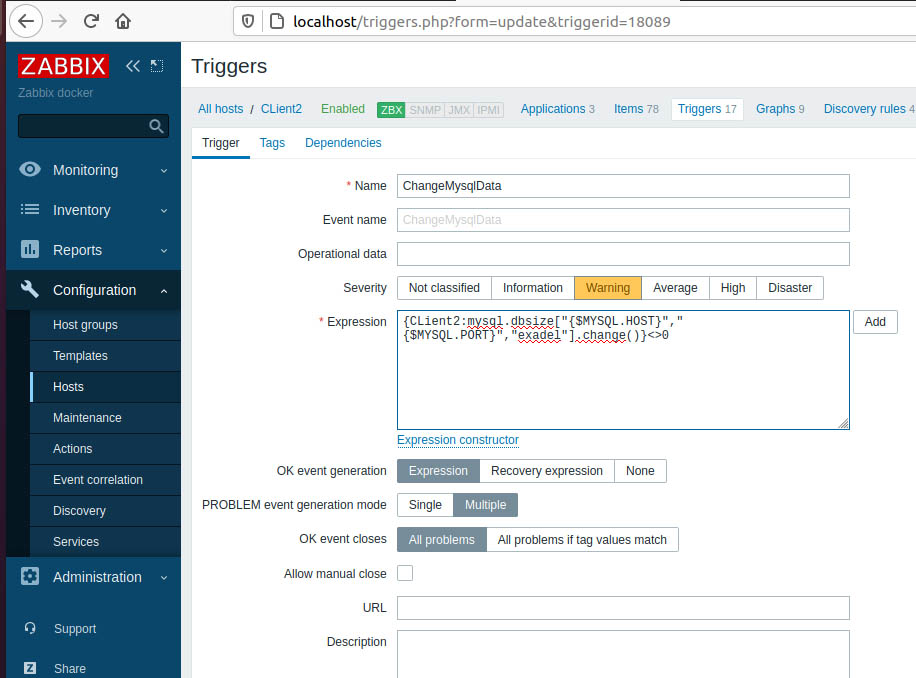 

Добавил новый Dashboard MySQL-server-mysql
Изменил размер базы добавивновую таблицу. 
Вывел Problem в dasboard

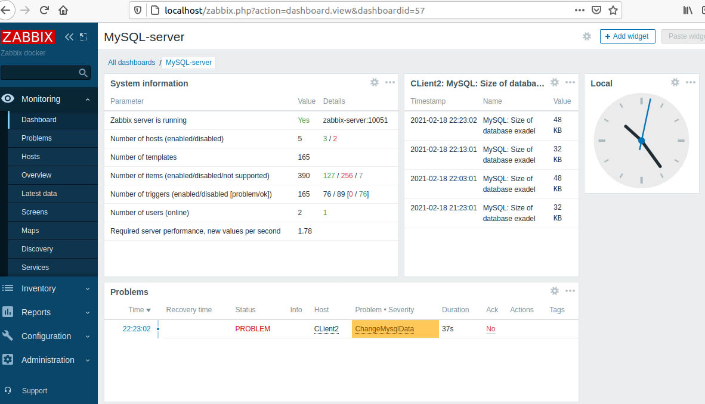 


###  1.4 Active check vs passive check  ###

При пассивном агенте данные запрашиваются сервером, а при активном данные отправляются самими агентами.
RefreshActiveChecks в настройках zabbix агента частота активный запрсов.

Создадим свой простой пассивный item.

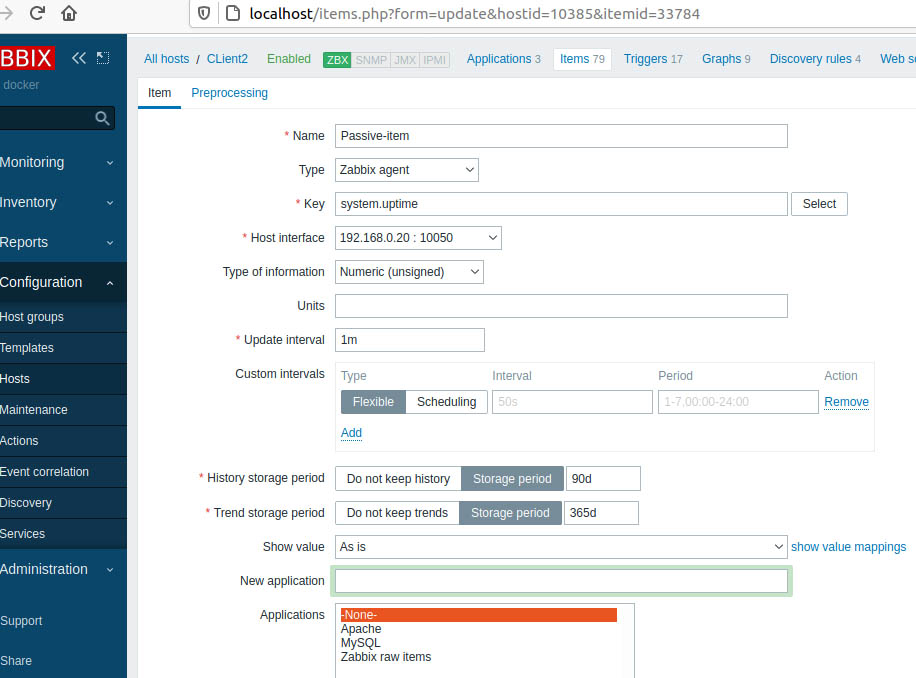 

Добавим  в Dashboard  

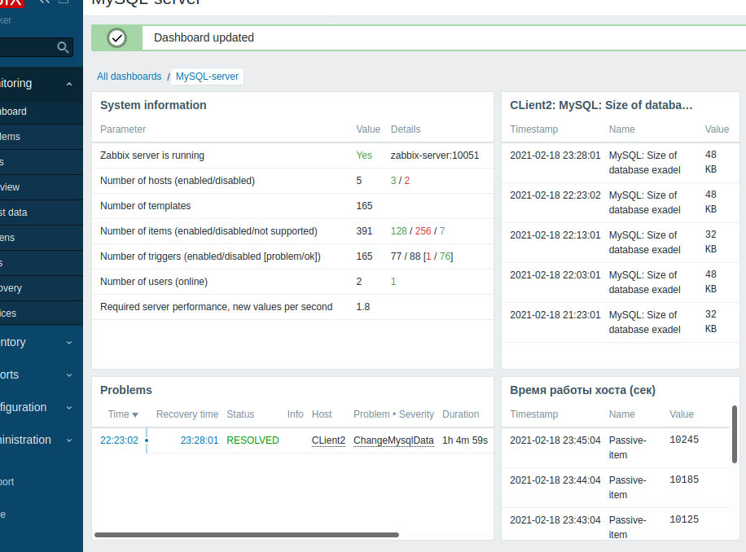 

Создадим свой простой активный  item.

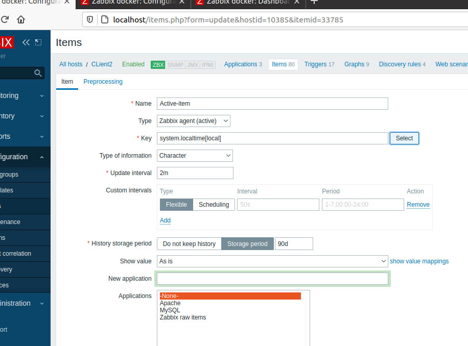 

Проверяем в файле конфигурации агента /etc/zabbix/zabbix_agentd.conf

	ServerActive=192.168.0.1
	RefreshActiveChecks=120

Делаем перезапуск агента
```sh
service zabbix-agent restart
```

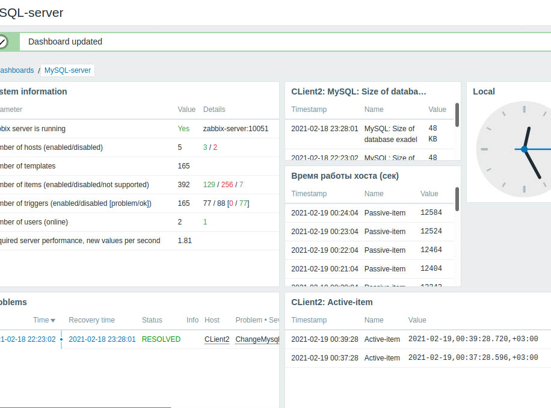 

###  1.5 Сделать безагентный чек любого ресурса (ICMP ping)  ###

Необходима  утилита fping:
```sh
sudo apt install fping
```

Обычно в Linux входящий ICMP  разрешен. Если  выключен, то добавим эти правила в iptables.
```sh
iptables -I INPUT -p icmp --icmp-type echo-request -j ACCEPT
iptables -I OUTPUT -p icmp --icmp-type echo-reply -j ACCEPT
```
Зайдем docker exec -u 0 -it zabbix-server bash
и изменим в /etc/zabbix/zabbix_server.conf
```sh
 apk update
 apk add nano
 ```
	FpingLocation=/usr/bin/fping

Перегружаем контейнер с zabbix-server

Добавляем Template ICMP_Ping

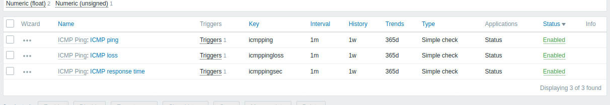 

Полный список ключей https://www.zabbix.com/documentation/current/ru/manual/config/items/itemtypes/simple_checks

Выводим в Dashboard:

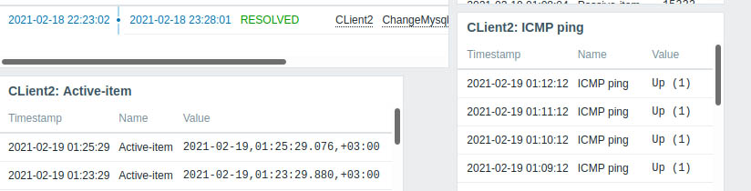 

###  1.6 Спровоцировать алерт - и создать Maintenance инструкцию  ###

Заходим в Настройка -> Maintenance

Устанавливаем время. Ставим No data collection

Останавливаю машину с MySQL: алерт в Problems не создается

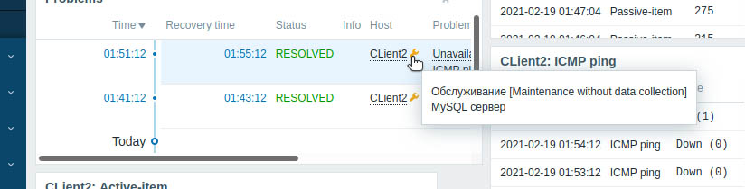 

Ставим With data collection/ Используем созданный для триггера тег NoPing 
Если заданы теги, тогда обслуживание по выбраным узлам сети будет ограничено проблемами с соответствующими тегами

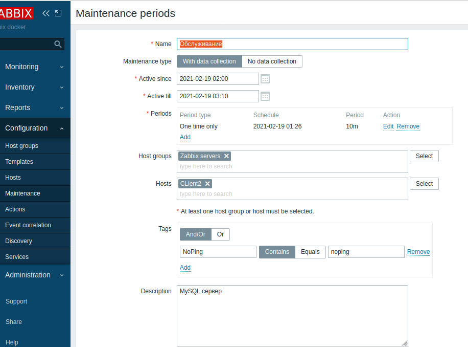 
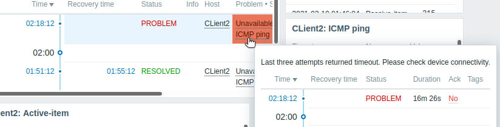 

###  1.7 Нарисовать дашборд   ###

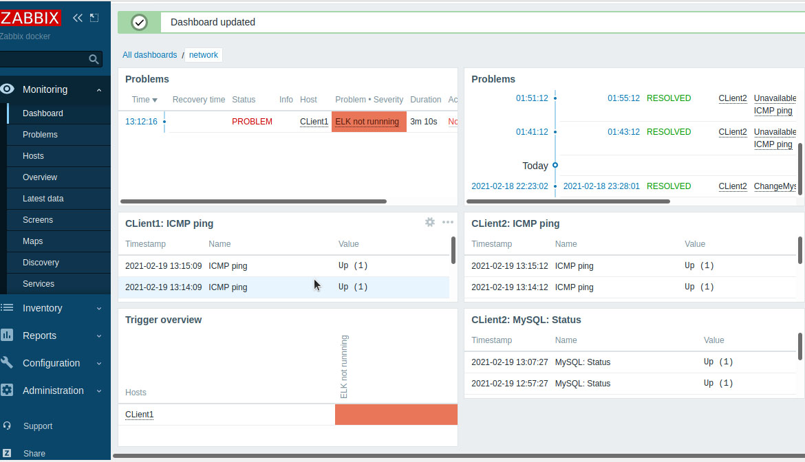 


##   ELK   ##

###  2.1 Установить и настроить ELK  ###

```sh
sudo apt update
```
##### Ставим nginx и https-transport
```sh
sudo apt install nginx install apt-transport-https -y
sudo nano /etc/nginx/sites-available/elk
```
	server {
		listen 80;

		server_name 192.168.0.10;  ###### localhost

		auth_basic "Restricted Access";
		auth_basic_user_file /etc/nginx/htpasswd.users;

		location / {
			proxy_pass http://localhost:5601;
			proxy_http_version 1.1;
			proxy_set_header Upgrade $http_upgrade;
			proxy_set_header Connection 'upgrade';
			proxy_set_header Host $host;
			proxy_cache_bypass $http_upgrade;
		}
	}

копируем (линкуем) в sites-enabled:
```sh
sudo ln -s /etc/nginx/sites-available/elk /etc/nginx/sites-enabled/elk
```
Установка виртуальной машины Java Java Runtime Environment (JRE).
```sh
sudo apt install default-jre -y
```
и компилятор JDK 
```sh
sudo apt install default-jdk -y
```
Java Runtime Environment (JRE).
Импортируем открытый ключ GPG Elasticsearch, с использованием которого защищаются пакеты Elastic, выполнив команду: 
```sh
sudo wget -qO - https://artifacts.elastic.co/GPG-KEY-elasticsearch | sudo apt-key add 
```
Добавляем репозиторий Elasticsearch в систему:
```sh
sudo echo "deb https://artifacts.elastic.co/packages/7.x/apt stable main" | sudo tee -a /etc/apt/sources.list.d/elastic-7.x.list
sudo apt update
```

##### Установка Elasticsearch
```sh
sudo apt install elasticsearch
```
Редактируем главный файл конфигурации Elasticsearch
```sh
sudo nano /etc/elasticsearch/elasticsearch.yml
```
задаем:
	network.host: localhost
	port: 9200
Добавляем в автозапуск:
```sh
sudo systemctl enable elasticsearch
```
Запускаем:
```sh
systemctl daemon-reload 
sudo systemctl enable elasticsearch.service 
sudo systemctl start elasticsearch
```
Из-за ошибок fatal signal was delivered to the control process пришлось устанавливать на новую виртуалку.
  

Проверяем: 
```sh
sudo systemctl status elasticsearch
curl -X GET "localhost:9200"
```
Частая ошибка: elasticsearch.service: Failed with result 'timeout'.
Немного помогло 
```sh
sudo systemctl edit --full elasticsearch.service
```
и установка  TimeoutStartSec=180  но, похоже и этого мало. 

#####  Далее устанавливаем  Kibana
```sh
sudo apt install kibana
sudo nano /etc/kibana/kibana.yml раскоментируем server.port, server.host и elasticsearch.hosts: 
```
Запускаем службу
```sh
sudo systemctl enable kibana
sudo systemctl start kibana
```
Проверяем статус:
```sh
systemctl status kibana.service
```

Вводим админа:
```sh
echo "admin:`openssl passwd -apr1`" | sudo tee -a /etc/nginx/htpasswd.users
```

Заходим в браузере:

	http://localhost:5601

##### Установка Logstash 
```sh
sudo apt install logstash
sudo nano /etc/logstash/conf.d/beats-input.conf
```
	input {
	beats {
	port => 5044
	}
	}

```sh
sudo nano /etc/logstash/conf.d/elasticsearch-output.conf
```

	output {
	if [@metadata][pipeline] {
	elasticsearch {
	hosts => ["localhost:9200"] manage_template => false
	index => "%{[@metadata][beat]}-%{[@metadata][version]}-%{+YYYY.MM.dd}"
	pipeline => "%{[@metadata][pipeline]}"
	}
	} else {
	elasticsearch {
	hosts => ["localhost:9200"] manage_template => false
	index => "%{[@metadata][beat]}-%{[@metadata][version]}-%{+YYYY.MM.dd}"
	}
	}
	}


Проверим конфигурацию Logstash:
```sh
sudo -u logstash /usr/share/logstash/bin/logstash --path.settings /etc/logstash -t
```
если OK, запускаем  Logstash:
```sh
sudo systemctl start logstash
sudo systemctl enable logstash
```
#####  Установим Filebeat.
```sh
sudo apt install filebeat
sudo nano /etc/filebeat/filebeat.yml
```

Комментируем output.elasticsearch и открываем output.logstash/bin/logstash

Включаем модуль
```sh
sudo filebeat modules enable system
sudo filebeat modules enable logstash
```
Посмотреть все модули:
```sh
sudo filebeat modules list
```

шаблон индекса Elasticsearch:
```sh
sudo filebeat setup --template -E output.logstash.enabled=false -E 'output.elasticsearch.hosts=["localhost:9200"]'
```
Дашборды позволяют визуализировать данные Filebeat отсылаемые в Kibana. Для включения дашборда и темплейтов:
```sh
sudo filebeat setup -E output.logstash.enabled=false -E output.elasticsearch.hosts=['localhost:9200'] -E setup.kibana.host=localhost:5601
```
Запуск и автозагрузка:
```sh
systemctl start filebeat
systemctl enable filebeat
```

заходим 192.168.0.10 , где ip хоста, где установлен elk

Вводим логин и пасс, созданные выше

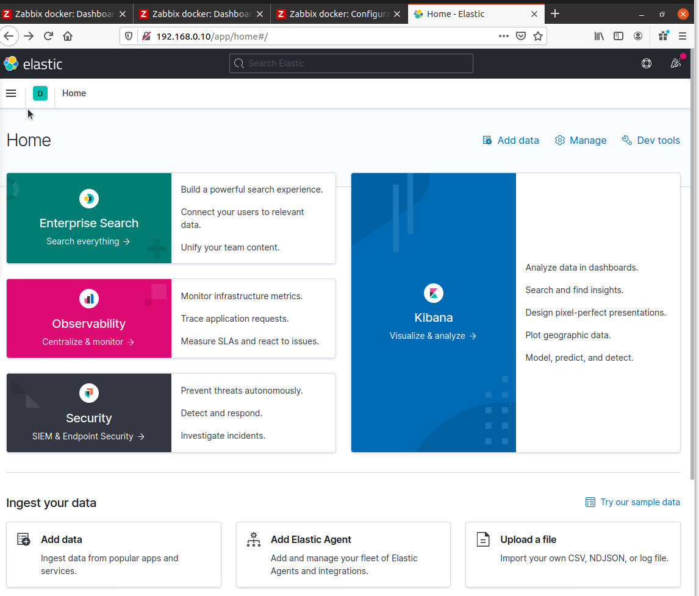 
_________________________________________

#####   Поскльку мы стремимся к автоматизации, сделаем установку через docker:

Рекомендуется:
 
в  /etc/sysctl.conf
добавить:

	vm.max_map_count=262144
Клонируем с GiyHub в папку  /opt/elk
sudo git clone https://github.com/deviantony/docker-elk /opt/elk

Устанавливаем nginx  как выше (хотя можно тоже было в контейнер)  и добавляем пользователя и пароль, используемые в docker-elk
```sh
echo "elastic:`openssl passwd -apr1`" | sudo tee -a /etc/nginx/htpasswd.users
```
pass: changeme


P.S. В дальнейшем изменяем docker-elk под себя. Все измения в папке docker-elk

###   2.2 - 2.6   ###

Добавляем в docker-compose  раздел для filebeats

Останавливаем все контейнеры:
```sh
docker stop $(docker ps -a -q)
```
и запускаем docker-compose снова

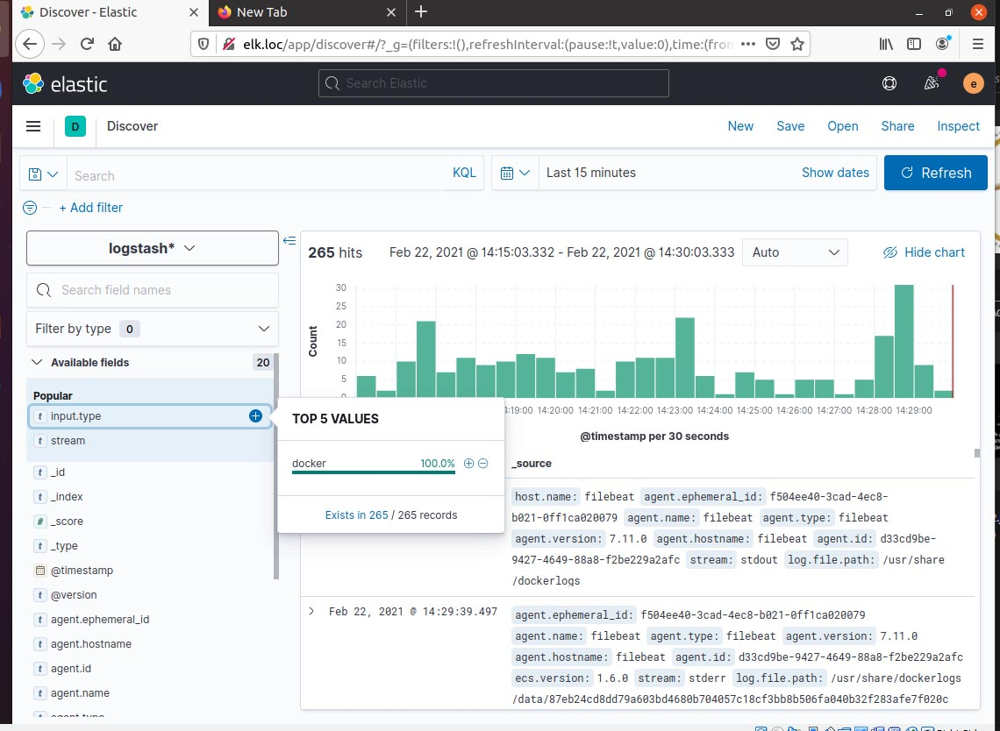 

#####  Установим filebeat через docker run на другом хосте:
```sh
docker pull docker.elastic.co/beats/filebeat:7.11.1

docker run \
docker.elastic.co/beats/filebeat:7.11.1 \
setup -E setup.kibana.host=192.168.0.10:5601 \
-E output.elasticsearch.username=elastic \
-E output.elasticsearch.password=changeme \
-E output.elasticsearch.hosts=["192.168.0.10:9200"]
```
Надо бы добавить конфигурационный файл:

```sh
curl -L -O https://raw.githubusercontent.com/elastic/beats/7.11/deploy/docker/filebeat.docker.yml
nano filebeat.docker.yml
```
меняем в нем ip на свой, добавляем user и password как выше

Запускаем контейнер:

	docker run -d \
	  --name=filebeat \
	  --user=root \
	  --volume="$(pwd)/filebeat.docker.yml:/usr/share/filebeat/filebeat.yml:ro" \
	  --volume="/var/lib/docker/containers:/var/lib/docker/containers:ro" \
	  --volume="/var/run/docker.sock:/var/run/docker.sock:ro" \
	  docker.elastic.co/beats/filebeat:7.11.1 filebeat -e -strict.perms=false \
	  -E output.elasticsearch.hosts=["192.168.0.10:9200"]
  
 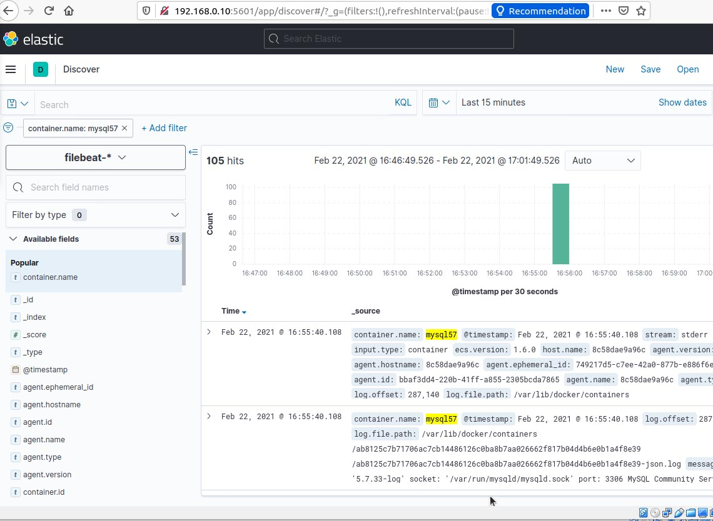  
   
 
 ##### Настроим вывод логов через metricbeat
 
 На хосте с elk выполняем :
 
 docker-compose -f docker-compose.yml -f extensions/metricbeat/metricbeat-compose.yml up
 
 т.к. там уже есть extensions/metricbeat
 
  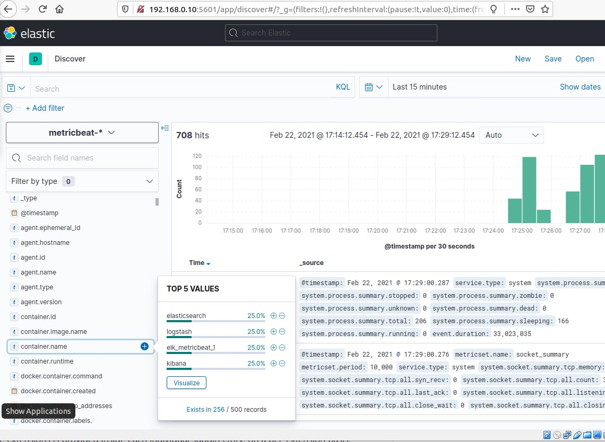  
  
  Заходим в контейнер 
  docker exec -it elk_metricbeat_1  bash
  
  Смотрим какие модули разрешены
  metricbeat modules list
  
  Раззрешаем :
  metricbeat modules enable docker
  
 Загружаем   dashbord templates
  
  metricbeat setup -e \
  -E output.logstash.enabled=false \
  -E output.elasticsearch.hosts=['192.168.0.10:9200'] \
  -E output.elasticsearch.username=elastic \
  -E output.elasticsearch.password=changeme \
  -E setup.kibana.host=192.168.0.10:5601
  
Строим  dashboard  
 
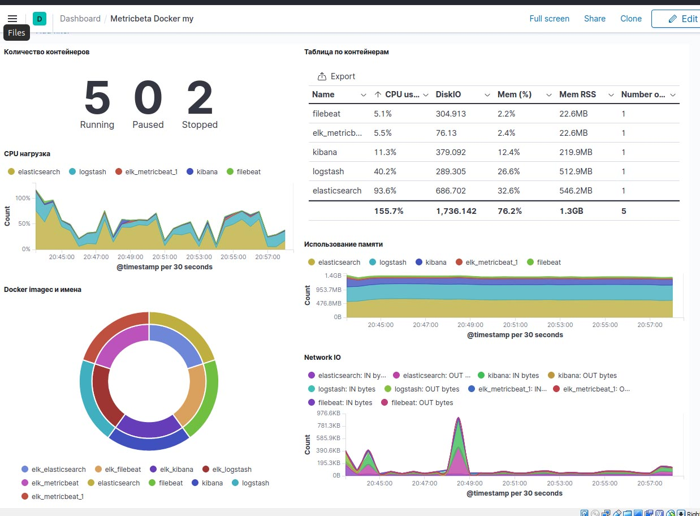 

##   Grafana   ##

Установим в контейнер

Добавим раздел grafana в наш /opt/elk

mkdir grafana
cd grafana
nano docker-compose.yml

version: '3.2'

services:
  grafana:
    image: grafana/grafana:latest
    container_name: grafana
	volumes:
      - /var/lib/grafana:/var/lib/grafana
	restart: always
	user: root
    ports:
      - "3000:3000"
    networks:
      - elk
    depends_on:
      - elasticsearch
	environment:
    - TERM=linux
    - GF_INSTALL_PLUGINS=grafana-clock-panel,grafana-piechart-panel,grafana-polystat-panel

mkdir /var/lib/grafana -p
cd ..
docker-compose -f docker-compose.yml -f grafana/docker-compose.yml up -d

Сменить пароль:
docker exec -it <name of grafana container> grafana-cli admin reset-admin-password admin


Натраиваем: Datasources > Add New > Elasticsearch и указываем в качестве indexname: metricbeat-*

Далее   Dashboards > New

Настраиваем панели, используя данные metricbeat (подсматривая как это сделано в Visualization elk

  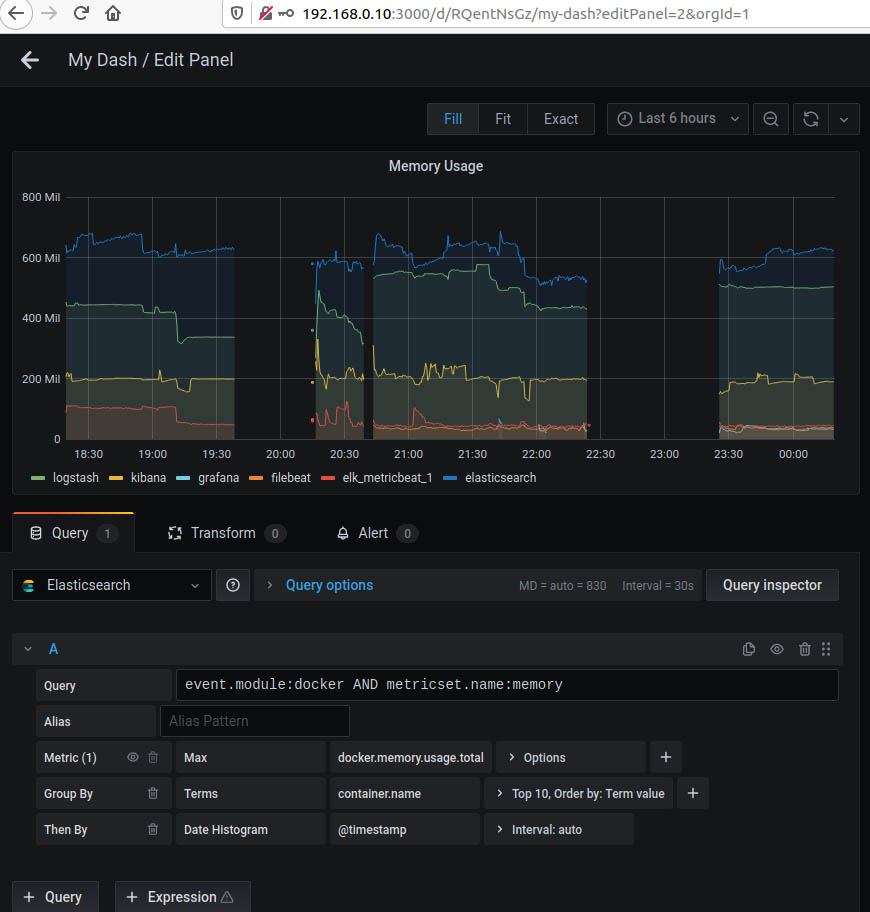  
  
 Получаем Dashboard
 
   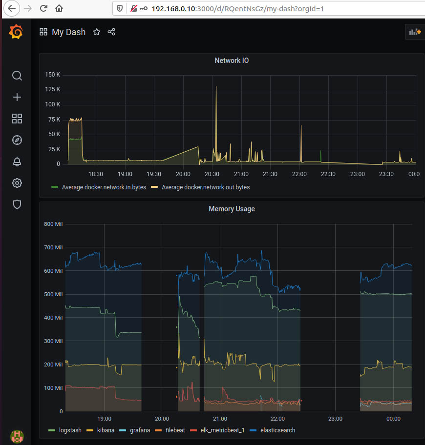 
  
  
